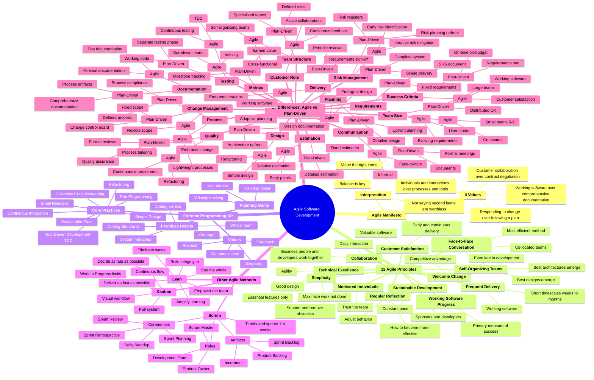

# Agile Software Development - Mind Map

```mermaid
mindmap
  root((Agile Software Development))
    **Agile Manifesto**
      **4 Values**
        Individuals and interactions over processes and tools
        Working software over comprehensive documentation
        Customer collaboration over contract negotiation
        Responding to change over following a plan
      **Interpretation**
        Value the right items
        Not saying second items are worthless
        Balance is key
    **12 Agile Principles**
      **Customer Satisfaction**
        Early and continuous delivery
        Valuable software
      **Welcome Change**
        Even late in development
        Competitive advantage
      **Frequent Delivery**
        Working software
        Short timescales weeks to months
      **Collaboration**
        Business people and developers work together
        Daily interaction
      **Motivated Individuals**
        Trust the team
        Support and remove obstacles
      **Face-to-Face Conversation**
        Most efficient method
        Co-located teams
      **Working Software Progress**
        Primary measure of success
      **Sustainable Development**
        Constant pace
        Sponsors and developers
      **Technical Excellence**
        Good design
        Agility
      **Simplicity**
        Maximize work not done
        Essential features only
      **Self-Organizing Teams**
        Best architectures emerge
        Best designs emerge
      **Regular Reflection**
        How to become more effective
        Adjust behavior
    **Extreme Programming XP**
      **Core Practices**
        Pair Programming
        Test-Driven Development TDD
        Continuous Integration
        Refactoring
        Simple Design
        Collective Code Ownership
        Small Releases
        Sustainable Pace
      **Planning Game**
        User stories
        Planning poker
        Velocity tracking
      **Values**
        Communication
        Simplicity
        Feedback
        Courage
        Respect
      **Practices Details**
        Coding Standards
        System Metaphor
        Whole Team
        Coding on Site
    **Other Agile Methods**
      **Scrum**
        Roles
          Product Owner
          Scrum Master
          Development Team
        Ceremonies
          Sprint Planning
          Daily Standup
          Sprint Review
          Sprint Retrospective
        Artifacts
          Product Backlog
          Sprint Backlog
          Increment
        Timeboxed sprints 1-4 weeks
      **Kanban**
        Visual workflow
        Work in Progress limits
        Pull system
        Continuous flow
      **Lean**
        Eliminate waste
        Amplify learning
        Decide as late as possible
        Deliver as fast as possible
        Empower the team
        Build integrity in
        See the whole
    **17 Differences: Agile vs Plan-Driven**
      **Planning**
        Agile
          Adaptive planning
          Emergent design
        Plan-Driven
          Upfront planning
          Detailed design
      **Requirements**
        Agile
          User stories
          Evolving requirements
        Plan-Driven
          SRS document
          Fixed requirements
      **Design**
        Agile
          Refactoring
          Simple design
        Plan-Driven
          Architecture upfront
          Design documentation
      **Testing**
        Agile
          Continuous testing
          TDD
        Plan-Driven
          Separate testing phase
          Test documentation
      **Delivery**
        Agile
          Frequent iterations
          Working software
        Plan-Driven
          Single delivery
          Complete system
      **Documentation**
        Agile
          Minimal documentation
          Working code
        Plan-Driven
          Comprehensive documentation
          Process artifacts
      **Customer Role**
        Agile
          Active collaboration
          Continuous feedback
        Plan-Driven
          Requirements sign-off
          Periodic reviews
      **Team Structure**
        Agile
          Self-organizing teams
          Cross-functional
        Plan-Driven
          Defined roles
          Specialized teams
      **Change Management**
        Agile
          Embraces change
          Flexible scope
        Plan-Driven
          Change control board
          Fixed scope
      **Risk Management**
        Agile
          Early risk identification
          Iterative risk mitigation
        Plan-Driven
          Risk planning upfront
          Risk registers
      **Estimation**
        Agile
          Relative estimation
          Story points
        Plan-Driven
          Detailed estimation
          Fixed estimates
      **Metrics**
        Agile
          Velocity
          Burndown charts
        Plan-Driven
          Earned value
          Milestone tracking
      **Process**
        Agile
          Lightweight processes
          Process tailoring
        Plan-Driven
          Defined process
          Process compliance
      **Quality**
        Agile
          Continuous improvement
          Refactoring
        Plan-Driven
          Quality assurance
          Formal reviews
      **Communication**
        Agile
          Face-to-face
          Informal
        Plan-Driven
          Documents
          Formal meetings
      **Success Criteria**
        Agile
          Customer satisfaction
          Working software
        Plan-Driven
          On-time on-budget
          Requirements met
      **Team Size**
        Agile
          Small teams 5-9
          Co-located
        Plan-Driven
          Large teams
          Distributed OK
```
