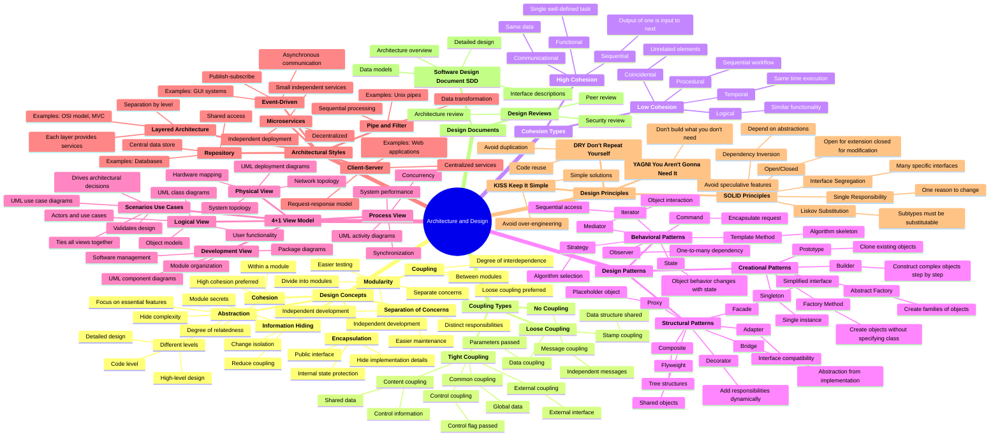

# Architecture and Design - Mind Map

```mermaid
mindmap
  root((Architecture and Design))
    **Design Concepts**
      **Abstraction**
        Hide complexity
        Focus on essential features
        Different levels
          High-level design
          Detailed design
          Code level
      **Modularity**
        Divide into modules
        Separate concerns
        Independent development
        Easier testing
      **Encapsulation**
        Hide implementation details
        Public interface
        Internal state protection
      **Information Hiding**
        Module secrets
        Reduce coupling
        Change isolation
      **Separation of Concerns**
        Distinct responsibilities
        Independent development
        Easier maintenance
      **Coupling**
        Degree of interdependence
        Between modules
        Loose coupling preferred
      **Cohesion**
        Degree of relatedness
        Within a module
        High cohesion preferred
    **Coupling Types**
      **Tight Coupling**
        Content coupling
          Shared data
          Control information
        Common coupling
          Global data
        External coupling
          External interface
        Control coupling
          Control flag passed
      **Loose Coupling**
        Stamp coupling
          Data structure shared
        Data coupling
          Parameters passed
      **No Coupling**
        Message coupling
          Independent messages
    **Cohesion Types**
      **Low Cohesion**
        Coincidental
          Unrelated elements
        Logical
          Similar functionality
        Temporal
          Same time execution
        Procedural
          Sequential workflow
      **High Cohesion**
        Communicational
          Same data
        Sequential
          Output of one is input to next
        Functional
          Single well-defined task
    **Design Patterns**
      **Creational Patterns**
        Singleton
          Single instance
        Factory Method
          Create objects without specifying class
        Abstract Factory
          Create families of objects
        Builder
          Construct complex objects step by step
        Prototype
          Clone existing objects
      **Structural Patterns**
        Adapter
          Interface compatibility
        Bridge
          Abstraction from implementation
        Composite
          Tree structures
        Decorator
          Add responsibilities dynamically
        Facade
          Simplified interface
        Flyweight
          Shared objects
        Proxy
          Placeholder object
      **Behavioral Patterns**
        Observer
          One-to-many dependency
        Strategy
          Algorithm selection
        Command
          Encapsulate request
        State
          Object behavior changes with state
        Template Method
          Algorithm skeleton
        Iterator
          Sequential access
        Mediator
          Object interaction
    **4+1 View Model**
      **Logical View**
        User functionality
        Actors and use cases
        UML class diagrams
        Object models
      **Process View**
        System performance
        Concurrency
        Synchronization
        UML activity diagrams
      **Development View**
        Software management
        Module organization
        UML component diagrams
        Package diagrams
      **Physical View**
        System topology
        Hardware mapping
        UML deployment diagrams
        Network topology
      **Scenarios Use Cases**
        Ties all views together
        Drives architectural decisions
        Validates design
        UML use case diagrams
    **Architectural Styles**
      **Layered Architecture**
        Separation by level
        Each layer provides services
        Examples: OSI model, MVC
      **Client-Server**
        Request-response model
        Centralized services
        Examples: Web applications
      **Pipe and Filter**
        Sequential processing
        Data transformation
        Examples: Unix pipes
      **Repository**
        Central data store
        Shared access
        Examples: Databases
      **Event-Driven**
        Asynchronous communication
        Publish-subscribe
        Examples: GUI systems
      **Microservices**
        Small independent services
        Decentralized
        Independent deployment
    **Design Principles**
      **SOLID Principles**
        Single Responsibility
          One reason to change
        Open/Closed
          Open for extension closed for modification
        Liskov Substitution
          Subtypes must be substitutable
        Interface Segregation
          Many specific interfaces
        Dependency Inversion
          Depend on abstractions
      **DRY Don't Repeat Yourself**
        Code reuse
        Avoid duplication
      **KISS Keep It Simple**
        Simple solutions
        Avoid over-engineering
      **YAGNI You Aren't Gonna Need It**
        Don't build what you don't need
        Avoid speculative features
    **Design Documents**
      **Software Design Document SDD**
        Architecture overview
        Detailed design
        Interface descriptions
        Data models
      **Design Reviews**
        Peer review
        Architecture review
        Security review
```
