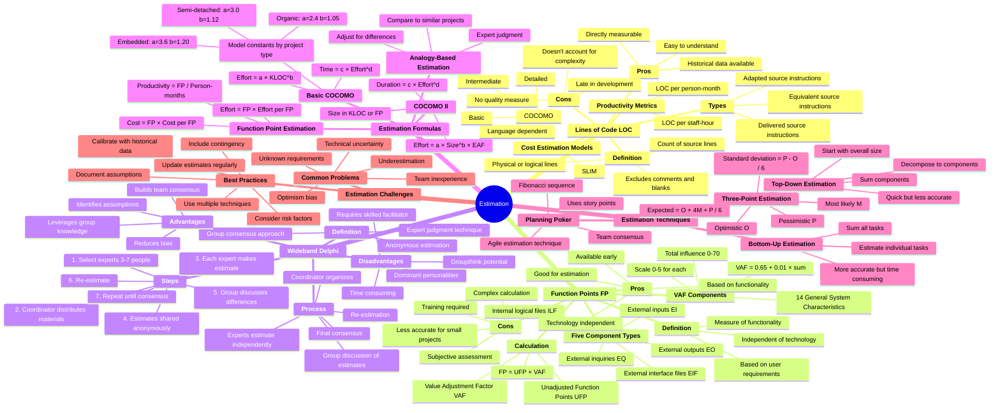

# Estimation - Mind Map

```mermaid
mindmap
  root((Estimation))
    **Lines of Code LOC**
      **Definition**
        Count of source lines
        Physical or logical lines
        Excludes comments and blanks
      **Types**
        Delivered source instructions
        Adapted source instructions
        Equivalent source instructions
      **Pros**
        Easy to understand
        Directly measurable
        Historical data available
      **Cons**
        Language dependent
        Doesn't account for complexity
        No quality measure
        Late in development
      **Productivity Metrics**
        LOC per person-month
        LOC per staff-hour
      **Cost Estimation Models**
        COCOMO
          Basic
          Intermediate
          Detailed
        SLIM
    **Function Points FP**
      **Definition**
        Measure of functionality
        Independent of technology
        Based on user requirements
      **Five Component Types**
        External inputs EI
        External outputs EO
        External inquiries EQ
        Internal logical files ILF
        External interface files EIF
      **Calculation**
        Unadjusted Function Points UFP
        Value Adjustment Factor VAF
        FP = UFP × VAF
      **VAF Components**
        14 General System Characteristics
        Scale 0-5 for each
        Total influence 0-70
        VAF = 0.65 + 0.01 × sum
      **Pros**
        Technology independent
        Available early
        Based on functionality
        Good for estimation
      **Cons**
        Subjective assessment
        Training required
        Complex calculation
        Less accurate for small projects
    **Wideband Delphi**
      **Definition**
        Expert judgment technique
        Group consensus approach
        Anonymous estimation
      **Process**
        Coordinator organizes
        Experts estimate independently
        Group discussion of estimates
        Re-estimation
        Final consensus
      **Steps**
        1. Select experts 3-7 people
        2. Coordinator distributes materials
        3. Each expert makes estimate
        4. Estimates shared anonymously
        5. Group discusses differences
        6. Re-estimate
        7. Repeat until consensus
      **Advantages**
        Reduces bias
        Leverages group knowledge
        Builds team consensus
        Identifies assumptions
      **Disadvantages**
        Time consuming
        Requires skilled facilitator
        Dominant personalities
        Groupthink potential
    **Estimation Formulas**
      **COCOMO II**
        Effort = a × Size^b × EAF
        Duration = c × Effort^d
        Size in KLOC or FP
      **Basic COCOMO**
        Effort = a × KLOC^b
        Time = c × Effort^d
        Model constants by project type
          Organic: a=2.4 b=1.05
          Semi-detached: a=3.0 b=1.12
          Embedded: a=3.6 b=1.20
      **Function Point Estimation**
        Productivity = FP / Person-months
        Cost = FP × Cost per FP
        Effort = FP × Effort per FP
      **Analogy-Based Estimation**
        Compare to similar projects
        Adjust for differences
        Expert judgment
    **Estimation Techniques**
      **Top-Down Estimation**
        Start with overall size
        Decompose to components
        Sum components
        Quick but less accurate
      **Bottom-Up Estimation**
        Estimate individual tasks
        Sum all tasks
        More accurate but time consuming
      **Three-Point Estimation**
        Optimistic O
        Most likely M
        Pessimistic P
        Expected = O + 4M + P / 6
        Standard deviation = P - O / 6
      **Planning Poker**
        Agile estimation technique
        Uses story points
        Fibonacci sequence
        Team consensus
    **Estimation Challenges**
      **Common Problems**
        Optimism bias
        Underestimation
        Unknown requirements
        Technical uncertainty
        Team inexperience
      **Best Practices**
        Use multiple techniques
        Calibrate with historical data
        Include contingency
        Update estimates regularly
        Document assumptions
        Consider risk factors
```
