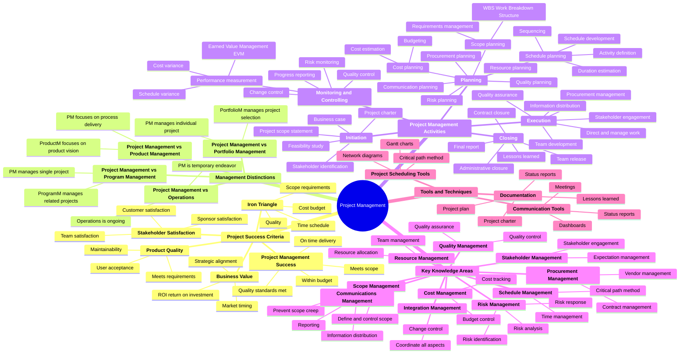

# Project Management - Mind Map

```mermaid
mindmap
  root((Project Management))
    **Project Success Criteria**
      **Iron Triangle**
        Time schedule
        Cost budget
        Scope requirements
        Quality
      **Stakeholder Satisfaction**
        Customer satisfaction
        Team satisfaction
        Sponsor satisfaction
      **Product Quality**
        Meets requirements
        User acceptance
        Maintainability
      **Business Value**
        ROI return on investment
        Strategic alignment
        Market timing
      **Project Management Success**
        On time delivery
        Within budget
        Meets scope
        Quality standards met
    **Management Distinctions**
      **Project Management vs Product Management**
        PM focuses on process delivery
        ProductM focuses on product vision
      **Project Management vs Program Management**
        PM manages single project
        ProgramM manages related projects
      **Project Management vs Portfolio Management**
        PM manages individual project
        PortfolioM manages project selection
      **Project Management vs Operations**
        PM is temporary endeavor
        Operations is ongoing
    **Project Management Activities**
      **Initiation**
        Project charter
        Stakeholder identification
        Feasibility study
        Business case
        Project scope statement
      **Planning**
        Scope planning
          WBS Work Breakdown Structure
          Requirements management
        Schedule planning
          Activity definition
          Sequencing
          Duration estimation
          Schedule development
        Cost planning
          Cost estimation
          Budgeting
        Quality planning
        Resource planning
        Communication planning
        Risk planning
        Procurement planning
      **Execution**
        Direct and manage work
        Quality assurance
        Team development
        Information distribution
        Stakeholder engagement
        Procurement management
      **Monitoring and Controlling**
        Performance measurement
          Earned Value Management EVM
          Schedule variance
          Cost variance
        Change control
        Quality control
        Risk monitoring
        Progress reporting
      **Closing**
        Contract closure
        Administrative closure
        Lessons learned
        Final report
        Team release
    **Key Knowledge Areas**
      **Integration Management**
        Coordinate all aspects
        Change control
      **Scope Management**
        Define and control scope
        Prevent scope creep
      **Schedule Management**
        Time management
        Critical path method
      **Cost Management**
        Budget control
        Cost tracking
      **Quality Management**
        Quality assurance
        Quality control
      **Resource Management**
        Team management
        Resource allocation
      **Communications Management**
        Information distribution
        Reporting
      **Risk Management**
        Risk identification
        Risk analysis
        Risk response
      **Procurement Management**
        Vendor management
        Contract management
      **Stakeholder Management**
        Stakeholder engagement
        Expectation management
    **Tools and Techniques**
      **Project Scheduling Tools**
        Gantt charts
        Network diagrams
        Critical path method
      **Communication Tools**
        Status reports
        Dashboards
        Meetings
      **Documentation**
        Project charter
        Project plan
        Status reports
        Lessons learned
```
