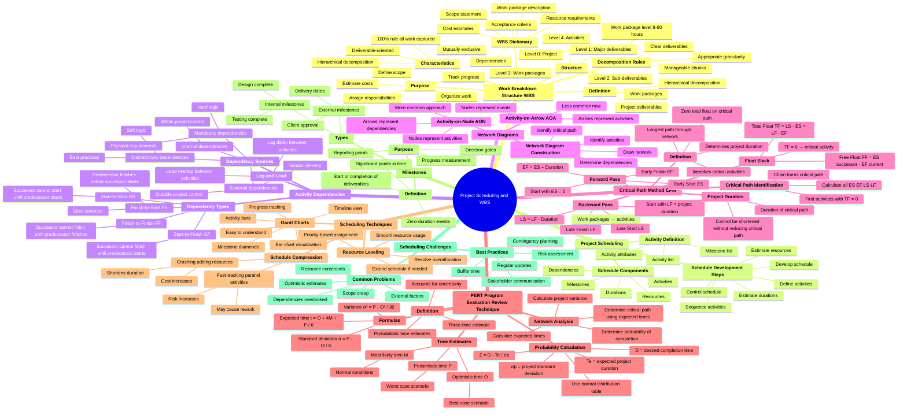

# Project Scheduling and WBS - Mind Map

```mermaid
mindmap
  root((Project Scheduling and WBS))
    **Work Breakdown Structure WBS**
      **Definition**
        Hierarchical decomposition
        Project deliverables
        Work packages
      **Purpose**
        Organize work
        Define scope
        Estimate costs
        Assign responsibilities
        Track progress
      **Structure**
        Level 0: Project
        Level 1: Major deliverables
        Level 2: Sub-deliverables
        Level 3: Work packages
        Level 4: Activities
      **Characteristics**
        100% rule all work captured
        Mutually exclusive
        Deliverable-oriented
        Hierarchical decomposition
      **Decomposition Rules**
        Work package level 8-80 hours
        Appropriate granularity
        Manageable chunks
        Clear deliverables
      **WBS Dictionary**
        Work package description
        Scope statement
        Acceptance criteria
        Dependencies
        Resource requirements
        Cost estimates
    **Project Scheduling**
      **Schedule Components**
        Activities
        Dependencies
        Durations
        Resources
        Milestones
      **Schedule Development Steps**
        Define activities
        Sequence activities
        Estimate resources
        Estimate durations
        Develop schedule
        Control schedule
      **Activity Definition**
        Work packages → activities
        Activity list
        Activity attributes
        Milestone list
    **Activity Dependencies**
      **Dependency Types**
        Finish-to-Start FS
          Most common
          Predecessor finishes before successor starts
        Start-to-Start SS
          Successor cannot start until predecessor starts
        Finish-to-Finish FF
          Successor cannot finish until predecessor finishes
        Start-to-Finish SF
          Successor cannot finish until predecessor starts
      **Dependency Sources**
        Mandatory dependencies
          Hard logic
          Physical requirements
        Discretionary dependencies
          Soft logic
          Best practices
        External dependencies
          Outside project control
          Vendor delivery
        Internal dependencies
          Within project control
      **Lag and Lead**
        Lag delay between activities
        Lead overlap between activities
    **Network Diagrams**
      **Activity-on-Node AON**
        Nodes represent activities
        Arrows represent dependencies
        More common approach
      **Activity-on-Arrow AOA**
        Arrows represent activities
        Nodes represent events
        Less common now
      **Network Diagram Construction**
        Identify activities
        Determine dependencies
        Draw network
        Identify critical path
    **Critical Path Method CPM**
      **Definition**
        Longest path through network
        Determines project duration
        Identifies critical activities
        Zero total float on critical path
      **Forward Pass**
        Early Start ES
        Early Finish EF
        EF = ES + Duration
        Start with ES = 0
      **Backward Pass**
        Late Start LS
        Late Finish LF
        LS = LF - Duration
        Start with LF = project duration
      **Float Slack**
        Total Float TF = LS - ES = LF - EF
        Free Float FF = ES successor - EF current
        TF = 0 → critical activity
      **Critical Path Identification**
        Calculate all ES EF LS LF
        Find activities with TF = 0
        Chain forms critical path
      **Project Duration**
        Duration of critical path
        Cannot be shortened without reducing critical path
    **PERT Program Evaluation Review Technique**
      **Definition**
        Probabilistic time estimates
        Accounts for uncertainty
        Three-time estimate
      **Time Estimates**
        Optimistic time O
          Best case scenario
        Most likely time M
          Normal conditions
        Pessimistic time P
          Worst case scenario
      **Formulas**
        Expected time t = O + 4M + P / 6
        Standard deviation σ = P - O / 6
        Variance σ² = P - O² / 36
      **Network Analysis**
        Calculate expected times
        Determine critical path using expected times
        Calculate project variance
        Determine probability of completion
      **Probability Calculation**
        Z = D - Te / σp
        D = desired completion time
        Te = expected project duration
        σp = project standard deviation
        Use normal distribution table
    **Scheduling Techniques**
      **Gantt Charts**
        Bar chart visualization
        Timeline view
        Activity bars
        Milestone diamonds
        Progress tracking
        Easy to understand
      **Resource Leveling**
        Smooth resource usage
        Resolve overallocation
        Extend schedule if needed
        Priority-based assignment
      **Schedule Compression**
        Crashing adding resources
          Cost increases
          Shortens duration
        Fast-tracking parallel activities
          Risk increases
          May cause rework
    **Milestones**
      **Definition**
        Zero-duration events
        Significant points in time
        Start or completion of deliverables
      **Types**
        External milestones
          Client approval
          Delivery dates
        Internal milestones
          Design complete
          Testing complete
      **Purpose**
        Progress measurement
        Reporting points
        Decision gates
    **Scheduling Challenges**
      **Common Problems**
        Optimistic estimates
        Resource constraints
        Dependencies overlooked
        Scope creep
        External factors
      **Best Practices**
        Buffer time
        Regular updates
        Risk assessment
        Contingency planning
        Stakeholder communication
```
