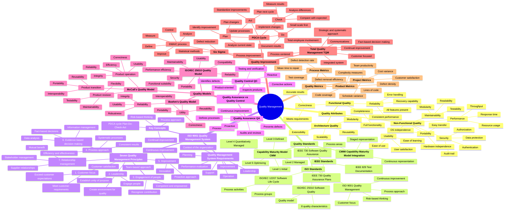

# Quality Management - Mind Map

```mermaid
mindmap
  root((Quality Management))
    **Quality Attributes**
      **Functional Quality**
        Correctness
          Meets requirements
          Accurate results
        Completeness
          All features present
          Full functionality
        Reliability
          Consistent performance
          Error handling
          Recovery capability
      **Non-Functional Quality**
        Performance
          Response time
          Throughput
          Resource usage
        Usability
          Ease of learning
          Ease of use
          User satisfaction
        Maintainability
          Modularity
          Readability
          Testability
        Portability
          Hardware independence
          OS independence
          Easy transfer
        Security
          Authentication
          Authorization
          Data protection
          Audit trail
      **Architecture Quality**
        Modularity
        Reusability
        Scalability
        Extensibility
    **Quality Standards**
      **ISO Standards**
        ISO 9001 Quality Management
          Process approach
          Risk-based thinking
          Continuous improvement
          Customer focus
        ISO/IEC 25010 Software Quality
          8 quality characteristics
          Quality model
        ISO/IEC 12207 Software Life Cycle
          Process groups
          Process activities
      **IEEE Standards**
        IEEE 730 Software Quality Assurance
        IEEE 829 Test Documentation
        IEEE 730 Quality Assurance Plans
      **Capability Maturity Model CMM**
        Level 1 Initial
        Level 2 Managed
        Level 3 Defined
        Level 4 Quantitatively Managed
        Level 5 Optimizing
      **CMMI Capability Maturity Model Integration**
        Staged representation
        Continuous representation
        Process areas
    **ISO 9001 Quality Management System**
      **Seven Quality Management Principles**
        1. Customer focus
          Meet customer requirements
          Exceed customer expectations
          Customer satisfaction
        2. Leadership
          Establish unity of purpose
          Create environment for quality
          Engage people
        3. Engagement of people
          Competent and empowered
          Recognize contribution
          Team-based approach
        4. Process approach
          Systematic processes
          Consistent results
          Efficiency and effectiveness
        5. Improvement
          Continuous improvement
          Innovation
          Proactive approach
        6. Evidence-based decision making
          Data analysis
          Fact-based decisions
          Information management
        7. Relationship management
          Supplier relationships
          Stakeholder management
          Mutual benefit
      **Quality Management System Requirements**
        Context of the organization
        Leadership
        Planning
        Support
        Operation
        Performance evaluation
        Improvement
      **Key Concepts**
        Risk-based thinking
        Process approach
        PDCA cycle Plan-Do-Check-Act
        Continual improvement
    **Quality Assurance vs Quality Control**
      **Quality Assurance QA**
        Process-oriented
        Prevents defects
        Proactive
        Defines processes
        Audits and reviews
        Continuous improvement
      **Quality Control QC**
        Product-oriented
        Identifies defects
        Reactive
        Inspects products
        Testing and verification
        Corrective actions
    **Quality Models**
      **McCall's Quality Model**
        Product operation
          Correctness
          Reliability
          Efficiency
          Integrity
          Usability
        Product revision
          Maintainability
          Flexibility
          Testability
        Product transition
          Portability
          Reusability
          Interoperability
      **ISO/IEC 25010 Quality Model**
        Functional suitability
        Performance efficiency
        Compatibility
        Usability
        Reliability
        Security
        Maintainability
        Portability
      **Boehm's Quality Model**
        Utility
          Portability
          Reusability
          Interoperability
          Correctness
        Reliability
          Robustness
          Integrity
          Usability
    **Quality Improvement**
      **PDCA Cycle**
        Plan
          Identify improvement
          Analyze current state
          Plan changes
        Do
          Implement changes
          Small scale first
          Document results
        Check
          Measure results
          Compare with expected
          Analyze differences
        Act
          Standardize improvements
          Update processes
          Plan next cycle
      **Six Sigma**
        DMAIC process
          Define
          Measure
          Analyze
          Improve
          Control
        Defect reduction
        Statistical methods
        Process improvement
      **Total Quality Management TQM**
        Customer focused
        Total employee involvement
        Process centered
        Integrated system
        Strategic and systematic approach
        Continual improvement
        Fact-based decision making
        Communications
    **Quality Metrics**
      **Product Metrics**
        Defect density
        Lines of code
        Complexity measures
        Code coverage
      **Process Metrics**
        Defect detection rate
        Defect removal efficiency
        Mean time to repair
        Test coverage
      **Project Metrics**
        Schedule variance
        Cost variance
        Customer satisfaction
        Team productivity
```
