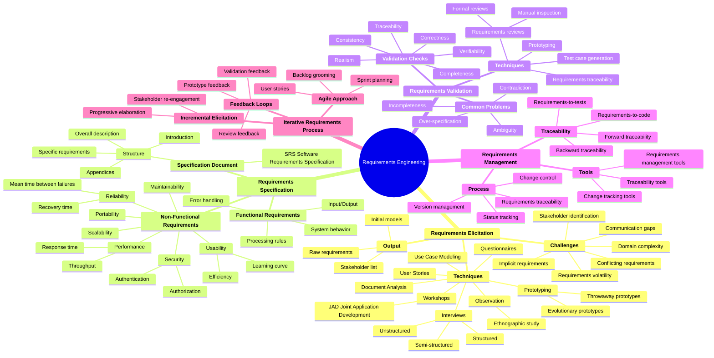

# Requirements Engineering - Mind Map

```mermaid
mindmap
  root((Requirements Engineering))
    **Requirements Elicitation**
      **Techniques**
        Interviews
          Structured
          Unstructured
          Semi-structured
        Workshops
          JAD Joint Application Development
        Observation
          Ethnographic study
        Questionnaires
        Document Analysis
        Prototyping
          Throwaway prototypes
          Evolutionary prototypes
        Use Case Modeling
        User Stories
      **Challenges**
        Stakeholder identification
        Requirements volatility
        Communication gaps
        Implicit requirements
        Domain complexity
        Conflicting requirements
      **Output**
        Raw requirements
        Initial models
        Stakeholder list
    **Requirements Specification**
      **Functional Requirements**
        System behavior
        Input/Output
        Processing rules
        Error handling
      **Non-Functional Requirements**
        Performance
          Response time
          Throughput
        Security
          Authentication
          Authorization
        Reliability
          Mean time between failures
          Recovery time
        Usability
          Learning curve
          Efficiency
        Maintainability
        Portability
        Scalability
      **Specification Document**
        SRS Software Requirements Specification
        Structure
          Introduction
          Overall description
          Specific requirements
          Appendices
    **Requirements Validation**
      **Techniques**
        Requirements reviews
          Manual inspection
          Formal reviews
        Prototyping
        Test case generation
        Requirements traceability
      **Validation Checks**
        Completeness
        Consistency
        Correctness
        Realism
        Verifiability
        Traceability
      **Common Problems**
        Ambiguity
        Incompleteness
        Contradiction
        Over-specification
    **Requirements Management**
      **Process**
        Change control
        Version management
        Requirements traceability
        Status tracking
      **Traceability**
        Backward traceability
        Forward traceability
        Requirements-to-code
        Requirements-to-tests
      **Tools**
        Requirements management tools
        Traceability tools
        Change tracking tools
    **Iterative Requirements Process**
      **Incremental Elicitation**
        Progressive elaboration
        Stakeholder re-engagement
      **Agile Approach**
        User stories
        Backlog grooming
        Sprint planning
      **Feedback Loops**
        Validation feedback
        Prototype feedback
        Review feedback
```
