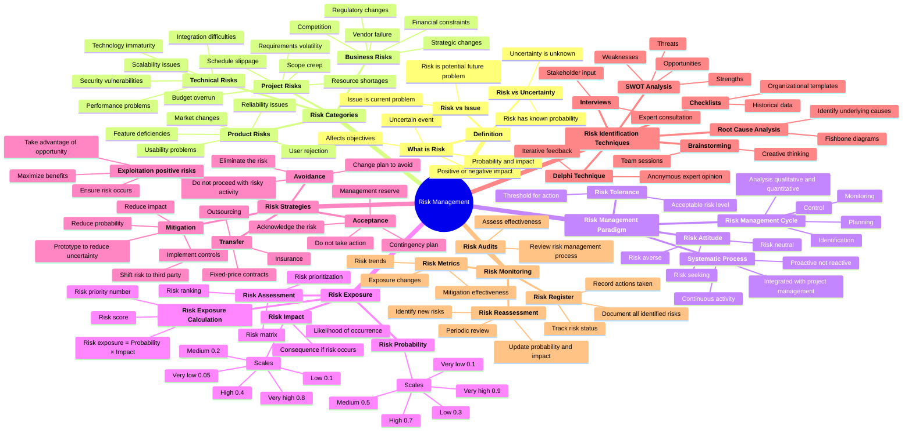

# Risk Management - Mind Map

```mermaid
mindmap
  root((Risk Management))
    **Definition**
      **What is Risk**
        Uncertain event
        Affects objectives
        Positive or negative impact
        Probability and impact
      **Risk vs Issue**
        Risk is potential future problem
        Issue is current problem
      **Risk vs Uncertainty**
        Risk has known probability
        Uncertainty is unknown
    **Risk Categories**
      **Project Risks**
        Schedule slippage
        Budget overrun
        Resource shortages
        Scope creep
        Requirements volatility
      **Technical Risks**
        Technology immaturity
        Integration difficulties
        Performance problems
        Scalability issues
        Security vulnerabilities
      **Product Risks**
        User rejection
        Feature deficiencies
        Usability problems
        Reliability issues
        Market changes
      **Business Risks**
        Strategic changes
        Competition
        Regulatory changes
        Financial constraints
        Vendor failure
    **Risk Management Paradigm**
      **Systematic Process**
        Continuous activity
        Integrated with project management
        Proactive not reactive
      **Risk Management Cycle**
        Identification
        Analysis qualitative and quantitative
        Planning
        Monitoring
        Control
      **Risk Attitude**
        Risk averse
        Risk neutral
        Risk seeking
      **Risk Tolerance**
        Acceptable risk level
        Threshold for action
    **Risk Exposure**
      **Risk Probability**
        Likelihood of occurrence
        Scales
          Very low 0.1
          Low 0.3
          Medium 0.5
          High 0.7
          Very high 0.9
      **Risk Impact**
        Consequence if risk occurs
        Scales
          Very low 0.05
          Low 0.1
          Medium 0.2
          High 0.4
          Very high 0.8
      **Risk Exposure Calculation**
        Risk exposure = Probability × Impact
        Risk priority number
        Risk score
      **Risk Assessment**
        Risk matrix
        Risk ranking
        Risk prioritization
    **Risk Strategies**
      **Avoidance**
        Eliminate the risk
        Change plan to avoid
        Do not proceed with risky activity
      **Mitigation**
        Reduce probability
        Reduce impact
        Implement controls
        Prototype to reduce uncertainty
      **Transfer**
        Shift risk to third party
        Insurance
        Outsourcing
        Fixed-price contracts
      **Acceptance**
        Acknowledge the risk
        Do not take action
        Contingency plan
        Management reserve
      **Exploitation positive risks**
        Ensure risk occurs
        Take advantage of opportunity
        Maximize benefits
    **Risk Identification Techniques**
      **Brainstorming**
        Team sessions
        Creative thinking
      **Checklists**
        Historical data
        Organizational templates
      **Interviews**
        Expert consultation
        Stakeholder input
      **SWOT Analysis**
        Strengths
        Weaknesses
        Opportunities
        Threats
      **Delphi Technique**
        Anonymous expert opinion
        Iterative feedback
      **Root Cause Analysis**
        Identify underlying causes
        Fishbone diagrams
    **Risk Monitoring**
      **Risk Register**
        Document all identified risks
        Track risk status
        Record actions taken
      **Risk Audits**
        Review risk management process
        Assess effectiveness
      **Risk Reassessment**
        Periodic review
        Update probability and impact
        Identify new risks
      **Risk Metrics**
        Risk trends
        Exposure changes
        Mitigation effectiveness
```
