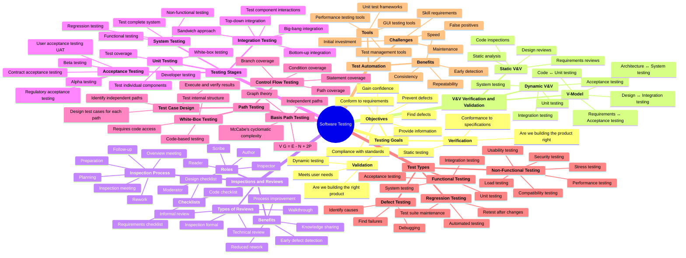

# Software Testing - Mind Map

```mermaid
mindmap
  root((Software Testing))
    **Testing Goals**
      **Verification**
        Are we building the product right
        Conformance to specifications
        Static testing
      **Validation**
        Are we building the right product
        Meets user needs
        Dynamic testing
      **Objectives**
        Find defects
        Prevent defects
        Gain confidence
        Provide information
        Conform to requirements
        Compliance with standards
    **V&V Verification and Validation**
      **Static V&V**
        Requirements reviews
        Design reviews
        Code inspections
        Static analysis
      **Dynamic V&V**
        Unit testing
        Integration testing
        System testing
        Acceptance testing
      **V-Model**
        Requirements ↔ Acceptance testing
        Architecture ↔ System testing
        Design ↔ Integration testing
        Code ↔ Unit testing
    **Inspections and Reviews**
      **Types of Reviews**
        Informal review
        Technical review
        Walkthrough
        Inspection formal
      **Inspection Process**
        Planning
        Overview meeting
        Preparation
        Inspection meeting
        Rework
        Follow-up
      **Roles**
        Author
        Moderator
        Inspector
        Reader
        Scribe
      **Checklists**
        Requirements checklist
        Design checklist
        Code checklist
      **Benefits**
        Early defect detection
        Reduced rework
        Knowledge sharing
        Process improvement
    **Testing Stages**
      **Unit Testing**
        Test individual components
        Developer testing
        White-box testing
        Test coverage
      **Integration Testing**
        Test component interactions
        Top-down integration
        Bottom-up integration
        Big-bang integration
        Sandwich approach
      **System Testing**
        Test complete system
        Functional testing
        Non-functional testing
        Regression testing
      **Acceptance Testing**
        User acceptance testing UAT
        Alpha testing
        Beta testing
        Contract acceptance testing
        Regulatory acceptance testing
    **Path Testing**
      **White-Box Testing**
        Test internal structure
        Code-based testing
        Requires code access
      **Basis Path Testing**
        McCabe's cyclomatic complexity
        V G = E - N + 2P
        Independent paths
        Graph theory
      **Control Flow Testing**
        Statement coverage
        Branch coverage
        Condition coverage
        Path coverage
      **Test Case Design**
        Identify independent paths
        Design test cases for each path
        Execute and verify results
    **Test Types**
      **Functional Testing**
        Unit testing
        Integration testing
        System testing
        Acceptance testing
      **Non-Functional Testing**
        Performance testing
        Load testing
        Stress testing
        Security testing
        Usability testing
        Compatibility testing
      **Regression Testing**
        Retest after changes
        Automated testing
        Test suite maintenance
      **Defect Testing**
        Find failures
        Identify causes
        Debugging
    **Test Automation**
      **Benefits**
        Repeatability
        Speed
        Consistency
        Early detection
      **Tools**
        Unit test frameworks
        Test management tools
        Performance testing tools
        GUI testing tools
      **Challenges**
        Initial investment
        Maintenance
        False positives
        Skill requirements
```
