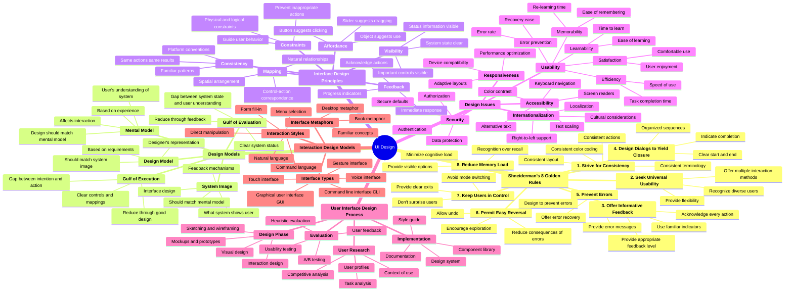

# UI Design - Mind Map

```mermaid
mindmap
  root((UI Design))
    **Shneiderman's 8 Golden Rules**
      **1. Strive for Consistency**
        Consistent terminology
        Consistent layout
        Consistent actions
        Consistent color coding
      **2. Seek Universal Usability**
        Recognize diverse users
        Provide flexibility
        Offer multiple interaction methods
      **3. Offer Informative Feedback**
        Acknowledge every action
        Provide appropriate feedback level
        Use familiar indicators
      **4. Design Dialogs to Yield Closure**
        Clear start and end
        Organized sequences
        Indicate completion
      **5. Prevent Errors**
        Design to prevent errors
        Provide error messages
        Offer error recovery
      **6. Permit Easy Reversal**
        Allow undo
        Reduce consequences of errors
        Encourage exploration
      **7. Keep Users in Control**
        Don't surprise users
        Avoid mode switching
        Provide clear exits
      **8. Reduce Memory Load**
        Minimize cognitive load
        Recognition over recall
        Provide visible options
    **Design Models**
      **Mental Model**
        User's understanding of system
        Based on experience
        Affects interaction
        Design should match mental model
      **System Image**
        What system shows user
        Interface design
        Feedback mechanisms
        Should match mental model
      **Design Model**
        Designer's representation
        Based on requirements
        Should match system image
      **Gulf of Execution**
        Gap between intention and action
        Reduce through good design
        Clear controls and mappings
      **Gulf of Evaluation**
        Gap between system state and user understanding
        Reduce through feedback
        Clear system status
    **Interface Design Principles**
      **Visibility**
        Important controls visible
        Status information visible
        System state clear
      **Feedback**
        Immediate response
        Acknowledge actions
        Progress indicators
      **Constraints**
        Prevent inappropriate actions
        Guide user behavior
        Physical and logical constraints
      **Consistency**
        Same actions same results
        Familiar patterns
        Platform conventions
      **Affordance**
        Object suggests use
        Button suggests clicking
        Slider suggests dragging
      **Mapping**
        Natural relationships
        Control-action correspondence
        Spatial arrangement
    **Design Issues**
      **Usability**
        Learnability
          Time to learn
          Ease of learning
        Efficiency
          Speed of use
          Task completion time
        Memorability
          Ease of remembering
          Re-learning time
        Error prevention
          Error rate
          Recovery ease
        Satisfaction
          User enjoyment
          Comfortable use
      **Accessibility**
        Screen readers
        Keyboard navigation
        Color contrast
        Text scaling
        Alternative text
      **Responsiveness**
        Adaptive layouts
        Device compatibility
        Performance optimization
      **Internationalization**
        Localization
        Right-to-left support
        Cultural considerations
      **Security**
        Authentication
        Authorization
        Data protection
        Secure defaults
    **User Interface Design Process**
      **User Research**
        Context of use
        User profiles
        Task analysis
        Competitive analysis
      **Design Phase**
        Sketching and wireframing
        Mockups and prototypes
        Interaction design
        Visual design
      **Evaluation**
        Heuristic evaluation
        Usability testing
        A/B testing
        User feedback
      **Implementation**
        Design system
        Component library
        Style guide
        Documentation
    **Interaction Design Models**
      **Interface Metaphors**
        Desktop metaphor
        Book metaphor
        Familiar concepts
      **Interaction Styles**
        Direct manipulation
        Menu selection
        Form fill-in
        Command language
        Natural language
      **Interface Types**
        Graphical user interface GUI
        Command line interface CLI
        Touch interface
        Voice interface
        Gesture interface
```
